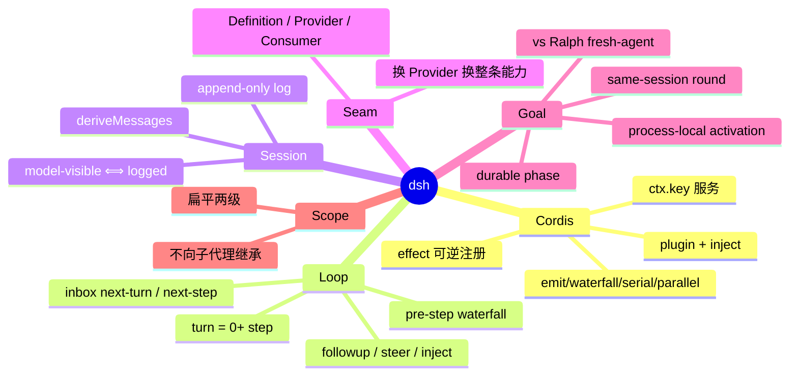

# DeepSeek Harness 面试概念卡

> 30 分钟速览。一句话答案；追问与源码见 [dsh-harness-detail.md](dsh-harness-detail.md)。
> 交互测验：[dsh-harness-cards.html](dsh-harness-cards.html) · 深度模拟：[dsh-harness-detail-cards.html](dsh-harness-detail-cards.html)

口诀：**一切皆插件；看见必入账；Goal 是状态不是调度器；激活不落盘。**

| 名字 | 路径 | 角色 |
|---|---|---|
| Cordis Context | `vendor/cordis` | 插件框架：服务、事件、可逆 effect |
| `ctx.sessions` | `packages/core/session` | append-only `SessionEvent` 日志 |
| `ctx.agents` / `Agent` | `packages/core/agent` | 活体句柄；扩展插件只依赖它 |
| `ctx.agentLoop` | `packages/core/agent-loop` | 默认可替换 driver |
| `ctx.tools` | `packages/core/tools` | 工具注册 + 三段 waterfall |
| `ctx.goals` | `packages/goal/goal` | 同会话目标状态机 |
| `dsh-goal-round-driver` | `packages/goal/goal-round-driver` | idle 时续跑 goal round |
| `dsh-tool-goal` | `packages/goal/tool-goal` | 模型侧 `get/create/update_goal` |
| `dsh-command-goal` | `packages/goal/command-goal` | 人类 `/goal`，不走模型回合 |

---

### Q1: 什么是 DeepSeek Harness？
> **Answer:** 基于 vendored Cordis 的插件式 agent harness：**everything is a plugin**，没有特权内核可打补丁。
> **Detail:** [Detail §1 Cordis](dsh-harness-detail.md#1-cordis-everything-is-a-plugin)

### Q2: Cordis 的五条核心？
> **Answer:** Plugin 实现 Service；Context 是服务仓库；`inject` 声明依赖；typed events 通信；注册是可逆 effect。
> **Detail:** [Detail §1](dsh-harness-detail.md#1-cordis-everything-is-a-plugin)

### Q3: waterfall 不调 `next()` 会怎样？
> **Answer:** 短路整条链；策略监听器可以故意短路，观察型监听器必须 `next()`。
> **Detail:** [Detail §1.2](dsh-harness-detail.md#12-waterfall)

### Q4: turn 和 step 的区别？
> **Answer:** step = 一次模型请求 + 它调用的工具；turn = 零或多个 step，直到没有未偿债务。
> **Detail:** [Detail §2](dsh-harness-detail.md#2-turn--step--inbox)

### Q5: followup / steer / inject 差在哪？
> **Answer:** `followup` 排队下一 turn 并唤醒；`steer` 交给最近 step 边界并可能唤醒；`inject` 只塞上下文、不唤醒。
> **Detail:** [Detail §2.2](dsh-harness-detail.md#22-投递三件套)

### Q6: 为什么「模型可见 ⟺ 已入账」？
> **Answer:** 任何进入模型请求的内容必须能从 session log 重建；新的模型可见输入必须新增 `SessionEventMap` 成员。
> **Detail:** [Detail §3](dsh-harness-detail.md#3-session-log)

### Q7: 什么是 capability seam？
> **Answer:** 可替换能力的完整三角色：Service Definition + Provider + Consumer；单独一个角色不是 seam。
> **Detail:** [Detail §4](dsh-harness-detail.md#4-capability-seam)

### Q8: 新行为该改 loop 还是挂插件？
> **Answer:** 挂已文档化的扩展点；改 `agent-loop` 必须同步改 `docs/architecture.md`。
> **Detail:** [Detail §2.3](dsh-harness-detail.md#23-扩展点不是改-loop)

### Q9: Goal 是什么？不是什么？
> **Answer:** 挂在**已有会话**上的一条持久完成目标（状态）；不是调度器、不是新会话、不是 Ralph。
> **Detail:** [Detail §5](dsh-harness-detail.md#5-same-session-goal)

### Q10: phase 和 activation 为什么拆开？
> **Answer:** `phase` 回答目标发生了什么（可重放）；`activation` 回答本进程可否自动续跑（resume/fork 后必须人工再授权）。
> **Detail:** [Detail §5.2](dsh-harness-detail.md#52-phase-vs-activation面试高频)

### Q11: 谁消耗 `maxGoalRounds`？
> **Answer:** 只有被承认的 goal-sourced `user/message`；同会话里的人类 turn 不计数。
> **Detail:** [Detail §5.3](dsh-harness-detail.md#53-round-合同)

### Q12: 模型何时可以 `complete` / `blocked`？
> **Answer:** complete 必须对照真实状态取证；blocked 默认要同一条件连续 ≥3 个 goal round（人类可立即停）。
> **Detail:** [Detail §5.4](dsh-harness-detail.md#54-工具权限)

### Q13: Goal vs Ralph？
> **Answer:** Goal = 同会话续跑、历史共享；Ralph = 每 round 全新子 agent、工作区 + 有界 handoff 才跨 round。
> **Detail:** [Detail §5.6](dsh-harness-detail.md#56-vs-ralph--vs-codex)

### Q14: scope 会不会传给 subagent？
> **Answer:** 不会。scope 扁平两级；子树行为用 lineage 数据表达，不用 scope 结构继承。
> **Detail:** [Detail §6](dsh-harness-detail.md#6-scope)

### Q15: 运行时 invariant 允许断言什么？
> **Answer:** 只断言权威事件流或可变数据关系；禁止靠「服务是否存在」或「插件元数据」证明不变量。
> **Detail:** [Detail §7](dsh-harness-detail.md#7-invariants--防御模式)

### Q16: 产品可见插件的测试最低标准？
> **Answer:** 非单元的真实 Loader 组合测试；手搓 `ctx.plugin(...)` 不够。模型/协议/人类可见变化还要 keyless snapshot。
> **Detail:** [Detail §8](dsh-harness-detail.md#8-测试政策)

---

## 真假题锚点（易踩坑）

| 陈述 | 真/假 | 误区 |
|---|---|---|
| Goal 是调度器，idle 了就自动重试失败 | 假 | 状态 ≠ 调度；异常失败要人类 resume |
| Session resume 后 active goal 会自动续跑 | 假 | activation 不落盘，必须再 `resume` |
| Codex 的 BudgetLimited 在 dsh goal 里也有 | 假 | dsh 只计量 round cap，token/时间另管 |
| waterfall 监听器永远必须 `next()` | 假 | 策略短路是设计；观察者才必须委托 |
| scoped 工具会自动出现在 subagent | 假 | 不继承 |
| `followup()` 返回值能等到这条助手回复 | 假 | 只标识 inbox 插入，不标识结果 |
| 改 loop 是加功能的正道 | 假 | 插件挂扩展点 |
| 模型说完成就可以 `complete` | 假 | 必须对真实状态取证 |
