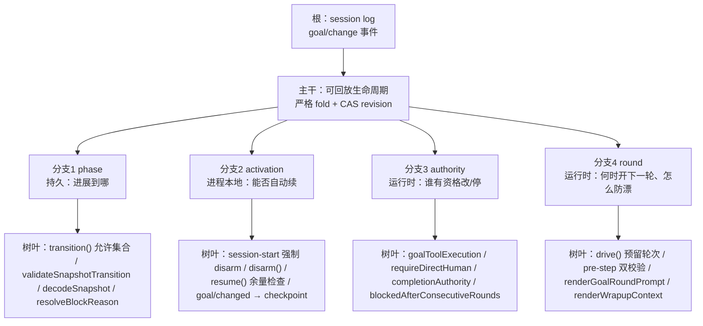

# goal 设计分析：agent harness 原则与主干 / 分支 / 树叶

> 本文拆解 `packages/goal/` 子系统的设计：它体现了哪些 agent harness 原则与技术（每条说清「是什么 / 不是什么」），以及目标功能如何按「根 / 主干 / 分支 / 树叶」分层。文内所有链接指向本仓库对应文件。

## 一、体现的 agent harness 原则与技术

### 1. 插件组合 + 能力接缝（everything is a plugin）

- **是什么**：goal 被切成「服务 + 多个消费者」——`dsh-goal` 持有状态（`ctx.goals`）；`dsh-tool-goal`（模型）、`dsh-command-goal`（人）、`dsh-goal-round-driver`（调度）分别通过公共 `ctx.goals` 与 `Agent` 服务消费它。`agent-loop` 一行没改。
- **不是什么**：不是在 agent-loop 里加一个 goal 分支；不是单体 feature。调度、命令、模型工具都不拥有状态。
- **证据**：[`packages/goal/README.md`](../packages/goal/README.md)（四插件角色表）、[`docs/architecture.md`](../docs/architecture.md)（goal 机制表）、[`docs/glossary.md#capability-seam`](../docs/glossary.md#capability-seam)

### 2. 事件溯源：日志即唯一真相

- **是什么**：goal 状态不单独存表；每次变更追加一条 `goal/change` 会话事件，当前状态由事件流 fold 出来。严格 fold 校验转移合法性，非法则立即抛错；投影 fold 只保留最新整份快照（不校验转移，因为写入侧已经校验过）。
- **不是什么**：不是 SQLite 每个会话一行（那是 Codex 目标功能的做法）；不是「当前态直接存字段、日志是副产物」。
- **证据**：[`packages/goal/goal/src/domain.ts`](../packages/goal/goal/src/domain.ts)（`goal/change` 事件定义）、[`packages/goal/goal/src/fold.ts`](../packages/goal/goal/src/fold.ts)（严格回放 fold）、[`packages/goal/goal/src/index.ts`](../packages/goal/goal/src/index.ts)（`applyGoalProjection` / `commit`）

### 3. 模型可见 ⟺ 已落日志（model-visible ⟺ logged）

- **是什么**：凡是进入模型请求的内容都能从 session 日志重建——goal 状态是 `goal/change` 事件，续跑提示是带 `GoalMessageSource` 的 `user/message` 事件。
- **不是什么**：不是仅存内存、重启即丢、无法回放的 steering。
- **证据**：[`packages/goal/goal/src/domain.ts`](../packages/goal/goal/src/domain.ts)（`GoalMessageSource` + `SessionEventMap`）、[`packages/goal/goal/src/fold.ts`](../packages/goal/goal/src/fold.ts)（`applyGoalEvent` 认 `user/message` 的 goal round）

### 4. 比较并设置（CAS）

- **是什么**：每次变更带 `{ id, revision }`，revision 单调 +1，过期引用抛 `GOAL_STALE_REVISION`；模型被要求先 `get_goal` 再复制精确 id/revision。
- **不是什么**：不是无条件后写覆盖；不是加锁串行化。
- **证据**：[`packages/goal/goal/src/types.ts`](../packages/goal/goal/src/types.ts)（`GoalRef`）、[`packages/goal/goal/src/index.ts`](../packages/goal/goal/src/index.ts)（`expectCurrent`）

### 5. 持久 phase 与进程本地 activation 分离

- **是什么**：`phase`（`active` / `paused` / `blocked` / `complete`）持久化；`activation`（`armed` / `disarmed`）只在进程内、永不落盘，`session-start` 强制 disarm。
- **不是什么**：不是把「能否自动续跑」写进日志，让恢复或 fork 的会话自动继续执行。
- **证据**：[`packages/goal/goal/src/types.ts`](../packages/goal/goal/src/types.ts)（`GoalActivation`）、[`packages/goal/goal/src/index.ts`](../packages/goal/goal/src/index.ts)（`agent/session-start` 处理）

### 6. 运行时权限 + 宿主签发

- **是什么**：权限在执行期校验——精确匹配的存活 agent、`running`、当前 initiator、开放 turn。改目标需当前根 agent 轮次里有宿主签发的 `{ kind: 'user' }` 消息；`complete` / `blocked` 额外接受「当前 goal round」这条窄通道（只能报告终止，不能改目标）。
- **不是什么**：不是靠提示词约束模型；不是靠持久化的 root/fork 血缘决定 live 权限。
- **证据**：[`packages/goal/tool-goal/src/authority.ts`](../packages/goal/tool-goal/src/authority.ts)（`goalToolExecution` / `requireDirectHuman` / `completionAuthority`）

### 7. 品牌化不透明 ID

- **是什么**：`GoalId = Branded<'GoalId'>`，不是裸 `string`。
- **不是什么**：不是把裸 string 当 ID；不泄露内部结构。
- **证据**：[`packages/goal/goal/src/types.ts`](../packages/goal/goal/src/types.ts)（`GoalId`）、[`packages/goal/goal/src/runtime.ts`](../packages/goal/goal/src/runtime.ts)（`GoalId()`）

### 8. 显式配置、非法即抛

- **是什么**：`blockedAfterConsecutiveRounds`（默认 3）、`defaultMaxGoalRounds`（默认 256）都是经过校验的 Config 字段，非法值加载即抛。
- **不是什么**：不是硬编码的可调参数；不是藏在 `run()` 里的 `?? default`。
- **证据**：[`packages/goal/tool-goal/src/index.ts`](../packages/goal/tool-goal/src/index.ts)（`resolveConfig`）、[`packages/goal/goal/src/index.ts`](../packages/goal/goal/src/index.ts)（`resolveMaxGoalRounds` / `Static Config`）

### 9. 空闲自启动、一次一续

- **是什么**：agent 空闲 + `active` + `armed` + 有余量时，才预留下一轮（`roundsStarted + 1`）并 `followup` 一条提示；每次空闲最多一次续跑，不 busy-loop。
- **不是什么**：不是重试队列；不是定时器轮询；不是循环计数器。
- **证据**：[`packages/goal/goal-round-driver/src/index.ts`](../packages/goal/goal-round-driver/src/index.ts)（`readyToDrive` / `drive` / `requestDrive`）

### 10. 反漂移重注入 + 证据先行

- **是什么**：每轮重新注入完整 objective（`<goal_round>`），要求把工作区 / 持久态当权威、拿证据再 complete；`blocked` 需连续 N 轮同条件 + 具体理由。
- **不是什么**：不是循环计数；不是「模型自己说了算就算完成」。
- **证据**：[`packages/goal/goal-round-driver/src/prompt.ts`](../packages/goal/goal-round-driver/src/prompt.ts)（`renderGoalRoundPrompt`）、[`packages/goal/tool-goal/src/wrapup.ts`](../packages/goal/tool-goal/src/wrapup.ts)、[`packages/goal/tool-goal/src/index.ts`](../packages/goal/tool-goal/src/index.ts)（blocked 门槛）

### 11. 失败即停 + 优雅释放

- **是什么**：持久化失败、队列失败、驱动异常都 disarm / block，不乐观重试；插件 teardown 关闭准入、disarm 全部 goal、cancel 活动回合并 await quiescence。
- **不是什么**：不是「异常自动重试」（README 明确列为 deferred work）。
- **证据**：[`packages/goal/goal-round-driver/src/index.ts`](../packages/goal/goal-round-driver/src/index.ts)（`disarm` / 生命周期 teardown）

### 12. 显式状态机 + 封闭联合

- **是什么**：phase 转移由 fold + service 双重校验（revision+1、允许集合、计数器保留）；`GoalOperation` / `GoalCommand` 封闭联合，default 走 `assertNever`。
- **不是什么**：不是散落的布尔标志；不是散落的字符串比较。
- **证据**：[`packages/goal/goal/src/fold.ts`](../packages/goal/goal/src/fold.ts)（`validateSnapshotTransition`）、[`packages/goal/command-goal/src/index.ts`](../packages/goal/command-goal/src/index.ts)（`assertNever`）

## 二、逻辑层次：根 / 主干 / 分支 / 树叶

### 根（root）

session log 是唯一持久真相。goal 的一切持久状态都是追加进去的 `goal/change` 事件。

- [`packages/goal/goal/src/domain.ts`](../packages/goal/goal/src/domain.ts) —— `goal/change` 事件 + `GoalMessageSource` 归属

### 主干（trunk）

一条「可回放的生命周期状态机」：fold 事件流 → 当前 goal，revision 单调递增，CAS 提交。主干回答一个问题——**这个目标现在是什么版本、什么 phase**。

- [`packages/goal/goal/src/fold.ts`](../packages/goal/goal/src/fold.ts) —— 严格回放 fold（非法转移立即抛错）
- [`packages/goal/goal/src/index.ts`](../packages/goal/goal/src/index.ts) —— `GoalService`（CAS 提交 + 投影 fold）

### 分支（branches）

从主干分出的 4 条正交约束，各回答一个独立问题：

| 分支 | 回答的问题 | 载体 | 持久性 |
|---|---|---|---|
| phase | 「进展到哪」 | `GoalPhase` | 持久 |
| activation | 「还能不能自动续」 | `GoalActivation` | 进程本地 |
| authority | 「谁有资格改 / 停」 | `authority.ts` | 运行时 |
| round | 「何时开下一轮、怎么防漂」 | `goal-round-driver` | 运行时 |

### 树叶（leaves）

每根分支末端的实现：

**phase 分支**
- [`packages/goal/goal/src/index.ts`](../packages/goal/goal/src/index.ts) —— `transition()` 的允许集合
- [`packages/goal/goal/src/fold.ts`](../packages/goal/goal/src/fold.ts) —— `validateSnapshotTransition` / `decodeSnapshot`
- [`packages/goal/goal/src/index.ts`](../packages/goal/goal/src/index.ts) —— `resolveBlockReason`（阻塞理由校验）

**activation 分支**
- [`packages/goal/goal/src/index.ts`](../packages/goal/goal/src/index.ts) —— `agent/session-start` 强制 disarm、`disarm()`、`resume()` 余量检查
- [`packages/goal/goal-round-driver/src/index.ts`](../packages/goal/goal-round-driver/src/index.ts) —— `goal/changed` → `needsCheckpoint` → `requestDrive`

**authority 分支**
- [`packages/goal/tool-goal/src/authority.ts`](../packages/goal/tool-goal/src/authority.ts) —— `goalToolExecution` / `requireDirectHuman` / `completionAuthority`
- [`packages/goal/tool-goal/src/index.ts`](../packages/goal/tool-goal/src/index.ts) —— `blockedAfterConsecutiveRounds` 门槛

**round 分支**
- [`packages/goal/goal-round-driver/src/index.ts`](../packages/goal/goal-round-driver/src/index.ts) —— `drive()` 预留轮次、`validReservation` + `agent/pre-step` 双校验、`round-limit` / `queue-failed` 兜底
- [`packages/goal/goal-round-driver/src/prompt.ts`](../packages/goal/goal-round-driver/src/prompt.ts) —— `renderGoalRoundPrompt`（反漂移重注入）
- [`packages/goal/tool-goal/src/wrapup.ts`](../packages/goal/tool-goal/src/wrapup.ts) —— `renderWrapupContext`（终态收尾）

## 三、一句话总结

主干是「事件溯源的生命周期状态机」，四根分支分别是 phase（持久进展）、activation（进程本地续跑授权）、authority（运行时变更授权）、round（续跑调度与反漂移）；树叶是每根分支的末端实现。贯穿始终的一条主线是**「持久化状态」与「执行权限」的分离**——状态可以回放，权限必须重授。

## 四、对应文件索引

- [`packages/goal/goal/src/types.ts`](../packages/goal/goal/src/types.ts) —— 纯类型：`GoalId` / `GoalRef` / `GoalPhase` / `GoalActivation` / `GoalView` / `GoalProjection`
- [`packages/goal/goal/src/runtime.ts`](../packages/goal/goal/src/runtime.ts) —— `GOAL_CHANGE_VERSION`、`GoalError`、`GoalId` brand
- [`packages/goal/goal/src/domain.ts`](../packages/goal/goal/src/domain.ts) —— 宿主侧词汇：事件、消息归属、fold 形态、`goal/changed`
- [`packages/goal/goal/src/fold.ts`](../packages/goal/goal/src/fold.ts) —— 严格回放 fold + 严格解码
- [`packages/goal/goal/src/index.ts`](../packages/goal/goal/src/index.ts) —— `GoalService`（`ctx.goals`）+ 投影 fold
- [`packages/goal/tool-goal/src/index.ts`](../packages/goal/tool-goal/src/index.ts) —— 模型工具 `get_goal` / `create_goal` / `update_goal`
- [`packages/goal/tool-goal/src/authority.ts`](../packages/goal/tool-goal/src/authority.ts) —— 执行期权限校验
- [`packages/goal/tool-goal/src/wrapup.ts`](../packages/goal/tool-goal/src/wrapup.ts) —— 终态收尾指令
- [`packages/goal/goal-round-driver/src/index.ts`](../packages/goal/goal-round-driver/src/index.ts) —— 同会话续跑驱动
- [`packages/goal/goal-round-driver/src/prompt.ts`](../packages/goal/goal-round-driver/src/prompt.ts) —— 续跑提示渲染
- [`packages/goal/goal-round-driver/src/invariant.ts`](../packages/goal/goal-round-driver/src/invariant.ts) —— 续跑提示不变量伴侣
- [`packages/goal/command-goal/src/index.ts`](../packages/goal/command-goal/src/index.ts) —— 人类 `/goal` 命令
- [`docs/subsystems/goal.md`](../docs/subsystems/goal.md) —— goal 子系统参考
- [`docs/architecture.md`](../docs/architecture.md) —— 架构中的 goal 机制
- [`.agents/notes/implemented/feature/2026-07-19-persisted-same-session-goal-domain.md`](../.agents/notes/implemented/feature/2026-07-19-persisted-same-session-goal-domain.md) —— 领域持久化与 activation 决策
- [`.agents/notes/implemented/feature/2026-07-19-model-facing-goal-tools.md`](../.agents/notes/implemented/feature/2026-07-19-model-facing-goal-tools.md) —— 模型工具权限划分决策
- [`.agents/notes/implemented/feature/2026-07-19-same-session-goal-round-driver.md`](../.agents/notes/implemented/feature/2026-07-19-same-session-goal-round-driver.md) —— 续跑驱动的竞态与生命周期决策
- [`.agents/notes/implemented/feature/2026-07-19-human-goal-command.md`](../.agents/notes/implemented/feature/2026-07-19-human-goal-command.md) —— 人类 `/goal` 命令决策
