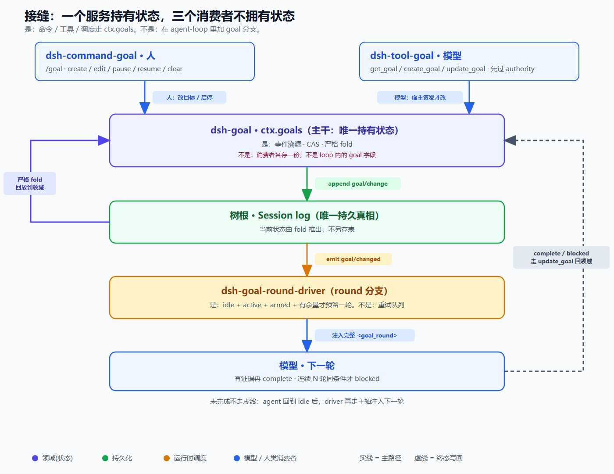
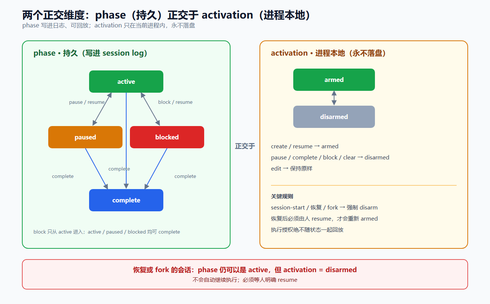
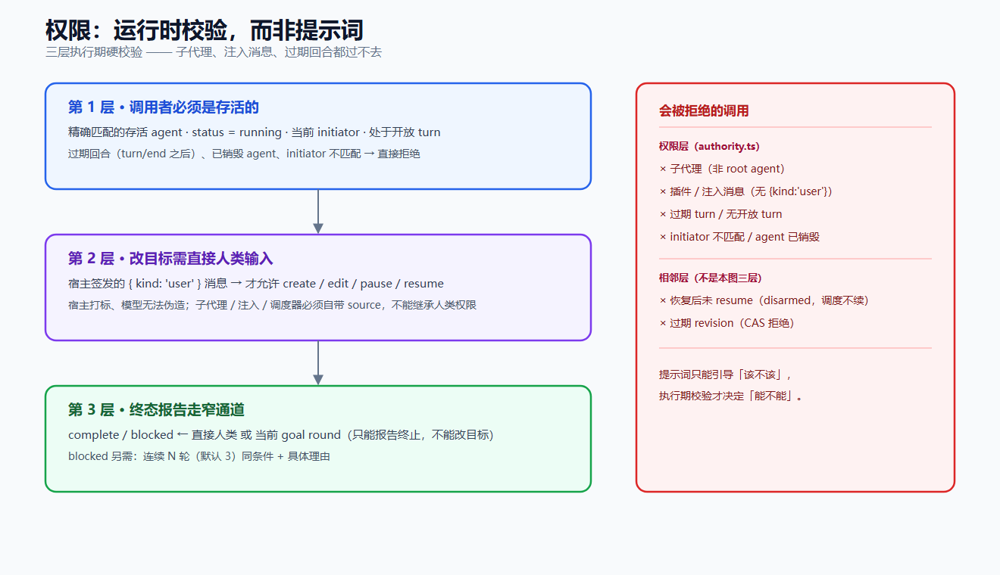
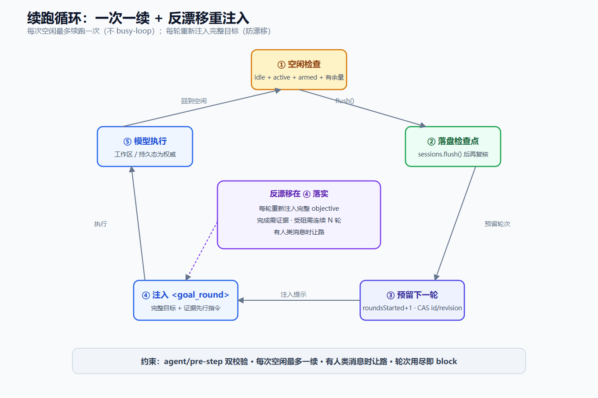

# goal 设计：概念、脉络、树根 → 主干 → 分支 → 树叶

> 拆解 `packages/goal/`。每层先钉「是什么 / 不是什么」，再落到树叶实现。文内链接指向本仓库文件。

**主线：状态可回放，权限必须重授。**

## 逻辑脉络

加一个长期目标，不要改 loop。判断按这条链推进——上一步的「不是什么」如果被做了，后面的树叶再漂亮也会在同一处裂开。

| 步 | 是什么 | 不是什么 |
|---|---|---|
| 需求 | Agent 盯住一个目标，跨回合工作直到真正完成 | 改 `agent-loop`、加计数器、把「请继续」写进提示词 |
| 接缝 | 一个 Goal 服务持有状态；命令 / 工具 / 调度只消费 | 单体 feature；消费者各自存状态 |
| 树根 | 每次变更追加 `goal/change`，当前态由日志 fold 出来 | 另存一张表；只活在内存、重启即丢的 steering |
| 主干 | 严格 fold + CAS → 现在是什么版本、什么 phase | 后写覆盖；散落的布尔标志 |
| 切开 | `phase` 持久；activation / authority / round 只在运行时 | 把「能否自动续跑」写进日志，让恢复或 fork 自己跑起来 |

横切纪律（约束整棵树，不是第五根分支）：插件接缝、`GoalId` branded、非法 Config 加载即抛。

## 树根 → 主干 → 分支 → 树叶

### 树根 · session log

| | |
|---|---|
| **回答** | 回放之后什么为真？ |
| **是什么** | 一切持久状态都是追加进去的 `goal/change`。进入模型请求的内容也能从日志重建（续跑提示是带 `GoalMessageSource` 的 `user/message`）。 |
| **不是什么** | 不是 SQLite 每个会话一行（Codex 目标功能的做法）。不是「当前态直接存字段、日志是副产物」。不是仅存内存的 steering。 |
| **证据** | [`domain.ts`](../packages/goal/goal/src/domain.ts)（`goal/change` + `GoalMessageSource`）、[`fold.ts`](../packages/goal/goal/src/fold.ts)（`applyGoalEvent` 认 goal round） |

### 主干 · 可回放生命周期

| | |
|---|---|
| **回答** | 这个目标现在是什么版本、什么 phase？ |
| **是什么** | 事件流 fold → 当前 goal。严格 fold 校验转移，非法即抛；投影 fold 只留最新快照（写入侧已经校验过）。每次变更带 `{ id, revision }`，revision 单调 +1。phase 转移由 fold + service 双重校验；操作 / 命令是封闭联合，漏网走 `assertNever`。 |
| **不是什么** | 不是无条件后写覆盖，不是加锁串行化。不是散落的布尔标志或字符串比较。 |
| **证据** | [`fold.ts`](../packages/goal/goal/src/fold.ts)（`validateSnapshotTransition`）、[`index.ts`](../packages/goal/goal/src/index.ts)（`expectCurrent` / `commit`）、[`command-goal`](../packages/goal/command-goal/src/index.ts)（`assertNever`） |

## 四根分支

各回答一个独立问题。正交：一根的答案不能冒充另一根。

| 分支 | 回答 | 持久性 |
|---|---|---|
| phase | 进展到哪 | 持久 |
| activation | 这一进程还能不能自动续 | 进程本地，永不落盘 |
| authority | 谁有资格改 / 停 | 运行时 |
| round | 何时开下一轮、怎么防漂 | 运行时 |

### 分支 · phase

| | |
|---|---|
| **是什么** | `active` / `paused` / `blocked` / `complete`。写进日志，可以回放。`block` 只从 `active` 进入；前三态均可 `complete`。 |
| **不是什么** | 不是「能否自动续跑」。`armed` 不写在 phase 里。 |
| **树叶** | [`index.ts`](../packages/goal/goal/src/index.ts) `transition()` 允许集合、`resolveBlockReason`；[`fold.ts`](../packages/goal/goal/src/fold.ts) `validateSnapshotTransition` / `decodeSnapshot` |

### 分支 · activation

| | |
|---|---|
| **是什么** | `armed` / `disarmed`，只在当前进程。`session-start` / 恢复 / fork 强制 `disarmed`。create / resume → armed；pause / complete / block / clear → disarmed；edit 保持原样。 |
| **不是什么** | 不是写进 `goal/change` 随状态回放。恢复后的会话即使 phase 仍是 `active`，也不会自己跑起来。 |
| **树叶** | [`index.ts`](../packages/goal/goal/src/index.ts) `agent/session-start` 强制 disarm、`disarm()` / `resume()` 余量检查；[`goal-round-driver`](../packages/goal/goal-round-driver/src/index.ts) `goal/changed` → checkpoint → `requestDrive` |

### 分支 · authority

| | |
|---|---|
| **是什么** | 执行期看活着的事实：存活 agent、`running`、当前 initiator、开放 turn。改目标需要当前根 agent 轮次里有宿主签发的 `{ kind: 'user' }`。`complete` / `blocked` 额外接受当前 goal round——只能报告终止，不能改目标。 |
| **不是什么** | 不是靠提示词约束模型。不是靠持久化的 root / fork 血缘决定 live 权限。子代理、插件注入、过期回合都过不去。 |
| **树叶** | [`authority.ts`](../packages/goal/tool-goal/src/authority.ts) `goalToolExecution` / `requireDirectHuman` / `completionAuthority`；[`tool-goal`](../packages/goal/tool-goal/src/index.ts) `blockedAfterConsecutiveRounds` |

### 分支 · round

| | |
|---|---|
| **是什么** | 空闲 + `active` + `armed` + 有余量，才预留 `roundsStarted + 1` 并注入完整 objective。每次空闲最多一续。complete 要工作区 / 持久态证据；blocked 要连续 N 轮同条件 + 具体理由。持久化 / 队列 / 驱动失败都 disarm / block。teardown 关闭准入、disarm 全部、cancel 活动回合、await quiescence。 |
| **不是什么** | 不是重试队列、定时轮询、循环计数器、busy-loop。不是「模型自己说了算就算完成」。不是异常自动重试（README 列为 deferred work）。 |
| **树叶** | [`goal-round-driver`](../packages/goal/goal-round-driver/src/index.ts) `drive()` / `validReservation` + `agent/pre-step` 双校验；[`prompt.ts`](../packages/goal/goal-round-driver/src/prompt.ts) `renderGoalRoundPrompt`；[`wrapup.ts`](../packages/goal/tool-goal/src/wrapup.ts) 终态收尾 |

## 横切纪律

这三项约束整棵树，不单独成枝。

| 纪律 | 是什么 | 不是什么 | 证据 |
|---|---|---|---|
| 插件接缝 | `dsh-goal` 持有 `ctx.goals`；tool / command / round-driver 消费它与 `Agent`。`agent-loop` 一行不改 | 在 loop 里加 goal 分支 | [`packages/goal/README.md`](../packages/goal/README.md)、[`glossary.md#capability-seam`](../docs/glossary.md#capability-seam) |
| branded id | `GoalId = Branded<'GoalId'>` | 裸 `string` 当 ID | [`types.ts`](../packages/goal/goal/src/types.ts)、[`runtime.ts`](../packages/goal/goal/src/runtime.ts) |
| 非法即抛 | `blockedAfterConsecutiveRounds`（默认 3）、`defaultMaxGoalRounds`（默认 256）是校验过的 Config | 硬编码可调参数；藏在 `run()` 里的 `?? default` | [`tool-goal`](../packages/goal/tool-goal/src/index.ts) `resolveConfig`、[`index.ts`](../packages/goal/goal/src/index.ts) `resolveMaxGoalRounds` |

## 文件索引

- [`types.ts`](../packages/goal/goal/src/types.ts) — `GoalId` / `GoalRef` / `GoalPhase` / `GoalActivation`
- [`runtime.ts`](../packages/goal/goal/src/runtime.ts) — brand、`GoalError`
- [`domain.ts`](../packages/goal/goal/src/domain.ts) — 事件、消息归属、`goal/changed`
- [`fold.ts`](../packages/goal/goal/src/fold.ts) — 严格回放 fold
- [`goal/src/index.ts`](../packages/goal/goal/src/index.ts) — `GoalService`、CAS、投影
- [`tool-goal/src/index.ts`](../packages/goal/tool-goal/src/index.ts) — 模型工具
- [`authority.ts`](../packages/goal/tool-goal/src/authority.ts) — 执行期权限
- [`wrapup.ts`](../packages/goal/tool-goal/src/wrapup.ts) — 终态收尾
- [`goal-round-driver/src/index.ts`](../packages/goal/goal-round-driver/src/index.ts) — 空闲续跑
- [`prompt.ts`](../packages/goal/goal-round-driver/src/prompt.ts) — 反漂移重注入
- [`command-goal/src/index.ts`](../packages/goal/command-goal/src/index.ts) — 人类 `/goal`
- [`docs/subsystems/goal.md`](../docs/subsystems/goal.md)
- [领域持久化与 activation](../.agents/notes/implemented/feature/2026-07-19-persisted-same-session-goal-domain.md)
- [模型工具权限](../.agents/notes/implemented/feature/2026-07-19-model-facing-goal-tools.md)
- [续跑驱动竞态](../.agents/notes/implemented/feature/2026-07-19-same-session-goal-round-driver.md)
- [人类命令](../.agents/notes/implemented/feature/2026-07-19-human-goal-command.md)
