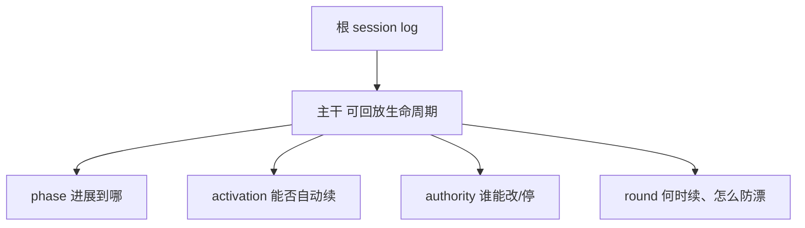

# dsh-goal 面试题

来源：[goal-design-principles.md](goal-design-principles.md) + `packages/goal/`。

自测 HTML：

- 概念卡：[html/dsh-goal/index.html](html/dsh-goal/index.html)
- 深挖卡：[html/dsh-goal-detail/index.html](html/dsh-goal-detail/index.html)

口诀：**状态可回放，权限必须重授。**

| 包 | 文件 | 角色 |
|---|---|---|
| `dsh-goal` | `packages/goal/goal/src/index.ts` | `ctx.goals`，唯一持有状态 |
| `dsh-goal` | `packages/goal/goal/src/fold.ts` | 严格回放 fold |
| `dsh-tool-goal` | `packages/goal/tool-goal/src/authority.ts` | 执行期权限 |
| `dsh-goal-round-driver` | `packages/goal/goal-round-driver/src/index.ts` | 空闲自启动 |
| `dsh-command-goal` | `packages/goal/command-goal/src/index.ts` | 人类 `/goal` |

---

## 概念卡

### Q1: 四个插件各自干什么？为什么不改 agent-loop？
> **Answer:** `dsh-goal` 持有状态；tool / command / round-driver 只消费 `ctx.goals`。新行为走能力接缝，不进循环。
> **Detail:** [§1 插件切分](#1-插件切分)

### Q2: goal 状态存在哪？和 Codex 一行 SQLite 差在哪？
> **Answer:** 不另存表。每次变更追加 `goal/change`，当前态由 fold 推出。Codex 是每会话一行。
> **Detail:** [§2 事件溯源](#2-事件溯源)

### Q3: 严格 fold 和投影 fold 差在哪？
> **Answer:** 严格 fold 校验转移，非法即抛。投影 fold 只留最新整份快照，因为写入侧已经校验过。
> **Detail:** [§2 事件溯源](#2-事件溯源)

### Q4: 什么是 CAS revision？
> **Answer:** 每次变更带 `{ id, revision }`，必须精确匹配当前 revision 再 +1；过期抛 `GOAL_STALE_REVISION`。
> **Detail:** [§3 CAS](#3-cas)

### Q5: phase 和 activation 为什么要拆开？
> **Answer:** phase 回答「进展到哪」，持久可回放；activation 回答「这一进程能不能自动续」，永不落盘。
> **Detail:** [§4 两维正交](#4-两维正交)

### Q6: 恢复 / fork 后为什么不自动续跑？
> **Answer:** `agent/session-start` 强制 `disarmed`。状态可以回放，执行授权必须人再 `resume`。
> **Detail:** [§4 两维正交](#4-两维正交)

### Q7: 空闲自启动的四个条件？
> **Answer:** `idle` + `active` + `armed` + 轮次有余量。每次空闲最多一续，不排队。
> **Detail:** [§6 续跑](#6-续跑)

### Q8: 反漂移靠什么，而不是靠循环计数？
> **Answer:** 每轮重新注入完整 objective；complete 要证据；blocked 要连续 N 轮同条件。
> **Detail:** [§6 续跑](#6-续跑)

### Q9: 改目标谁有资格？complete / blocked 呢？
> **Answer:** 改目标要根 agent 当前轮次里有宿主签发的 `{ kind: 'user' }`。complete / blocked 额外接受「当前 goal round」，但只能报终止。
> **Detail:** [§5 权限](#5-权限)

### Q10: 模型可见内容能否只活在内存里？
> **Answer:** 不能。进入模型请求的内容必须能从 session 日志重建（`goal/change` 或带 `GoalMessageSource` 的 `user/message`）。
> **Detail:** [§2 事件溯源](#2-事件溯源)

真假易混点：activation 会不会随日志回放？complete 能不能从 paused 进去？子代理能不能改目标？投影 fold 会不会校验转移？

---

## Detail

### 1. 插件切分

`packages/goal/README.md`：四包，状态只在 `dsh-goal`。

- 人：`dsh-command-goal` → `/goal`
- 模型：`dsh-tool-goal` → `get_goal` / `create_goal` / `update_goal`
- 调度：`dsh-goal-round-driver` → idle 时 `followup`
- 领域：`GoalService` 在 `packages/goal/goal/src/index.ts`

面试追问：为什么调度不能自己写状态？因为「持有状态」和「何时续跑」必须分开，否则恢复会话会把调度授权一起回放。

### 2. 事件溯源

`packages/goal/goal/src/domain.ts` 定义 `goal/change`。
`packages/goal/goal/src/fold.ts` 的 `validateSnapshotTransition` 是严格回放。
`applyGoalProjection`（`index.ts`）是投影：非法 / 非 goal 事件原样返回同一引用。

续跑提示也是日志：`GoalMessageSource` 挂在 `user/message` 上，`round > 0` 才计入 `roundsStarted`。

### 3. CAS

`GoalRef = { id, revision }`。`expectCurrent` 对不上就 `GOAL_STALE_REVISION`。
模型契约：先 `get_goal`，原样复制 id/revision。不是无条件后写覆盖，也不是加锁。

### 4. 两维正交

`GoalPhase`：`active` / `paused` / `blocked` / `complete`（持久）。
`GoalActivation`：`armed` / `disarmed`（进程本地）。

转移（`fold.ts` + `GoalService.transition`）：

| 操作 | 从 | 到 | activation |
|---|---|---|---|
| create | （无，或 complete 可替换） | active | armed |
| pause | active | paused | disarmed |
| block | **仅 active** | blocked | disarmed |
| resume | active / paused / blocked（且有余量） | active | armed |
| complete | active / paused / blocked | complete | disarmed |
| edit | 任意当前相 | 同相 | 保持原样 |
| session-start | — | — | 强制 disarmed |

陷阱：`resume` 在已经 `active + armed` 时会 `GOAL_INVALID_TRANSITION`。轮次用尽也不能 resume。

### 5. 权限

`packages/goal/tool-goal/src/authority.ts`：

1. `goalToolExecution`：精确匹配的存活 agent、`running`、当前 initiator、开放 turn。
2. `requireDirectHuman`：根 agent + 当前轮次有 `{ kind: 'user' }`。`followup`/`steer` 省略 source 会默认成 `user`，所以非人生产者必须自带 source。
3. `completionAuthority`：直接人类，或当前 goal 的精确 round（`goalId` + `revision` + `round === roundsStarted`）。

子代理、注入消息、过期 turn 都过不了。`disarmed` 和过期 revision **不是** 这三层：前者是调度，后者是 CAS。

### 6. 续跑

`goal-round-driver`：`readyToDrive` 要求 fiber ACTIVE、agent idle、无 competingQueued。
有人类消息插入 nextTurn 时 `competingQueued = true`，本轮 goal followup 标 stale，让路。
`drive()` 先 `sessions.flush()` 再复核，再预留 `roundsStarted+1`，注入 `renderGoalRoundPrompt`。
失败（flush / queue）disarm 或 `block(round-limit|queue-failed)`，不自动重试。

`renderGoalRoundPrompt` 每轮重写完整 objective，并要求以工作区 / 工具结果 / 持久态为权威。

### 7. 失败即停

`agent/error` → disarm。插件 teardown：关准入、disarm、cancel、await quiescence。README 把「异常自动重试」列为 deferred work。
