# 让 Agent 盯住一个目标连跑几天，不要去改主循环

**TL;DR**

- 这篇不是再做一个待办列表。它用「盯住一个目标连跑几天」当探针，压一遍 Agent Harness 的承诺。
- 承诺是：新能力接插件，不改发动机。接得上，Harness 才是运行时；接不上，它只是套了工具的聊天循环。
- 进展能记住；自动续跑必须重新授权。模型当时看见的话，必须能从日志翻出来。
- 「我做完了」不算完。听工作区。
- 能抄走的是切割，不是文件名。

你想让 Agent 盯住一件事，跨很多回合，直到真正做完。第一反应通常是三件快事：改主循环、加一个计数器、在提示词里写「请继续完成目标」。

这三条都会在同一处裂开。重启之后，没人说得清当时叮嘱了什么。从一份会话拷出来的新会话，自己跑起来。模型把题目偷偷改小，好早点收工。

DeepSeek Harness 没改主循环。贯穿始终的一句话是：**状态可以回放，权限必须重授。**

这不是文风。这是在验证一套运行时到底能不能当 Harness 用。

---

## 为什么这么做

Harness 对外的承诺很硬：一切都是插件。新行为接到已经写明的扩展点上，不改 `agent-loop`。架构表里有一行专门给这件事：**管理同会话目标，用 `ctx.goals`；续跑走 `agent/*`。**

长期目标正好是一根探针。它同时踩到六件 Harness 最容易骗人的事：

1. **一切都是插件。** 四个小插件拼起来，循环一行不动。接不上，说明「不改 loop」只是口号。
2. **模型可见 ⟺ 已落日志。** 会话日志是模型所见世界的来源。续跑时念的目标，必须能从这份日志翻出来。只活在内存里，恢复和拷会话会对不齐。
3. **持久事实 ≠ 执行授权。** 账可以回放；开机不准自己接着写。授权跟着日志走，恢复就会偷跑。
4. **续跑走公开事件。** 空闲了，通过 `agent/*` 再开一轮。伸进循环内脏，插件就不是插件。
5. **权限看这一回合还活着。** 提示词、血缘、拷出来的会话，都不能签发。只靠「请你别乱改」，子代理会改题。
6. **失败即停，配置非法即抛。** 过期写入丢掉；卸载要等到真正静下来。乐观重试会把账写花。

过了这六关，Harness 才是运行时，不只是套了工具的聊天循环。Goal 不是再做一个待办。它是在问：长期目标能不能当插件接上，而不拆开发动机。

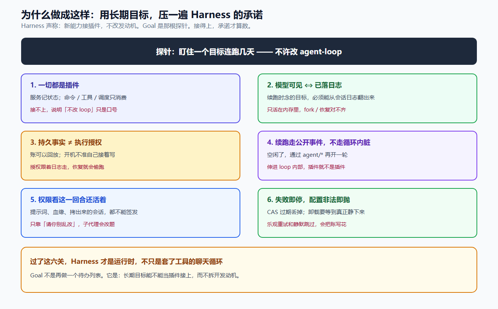

---

## 别把目标焊进发动机

发动机还是原来的发动机。目标是旁边一本账，翻得回来。

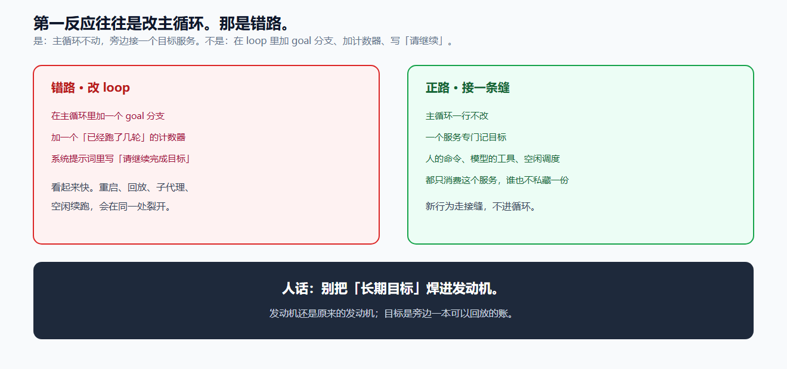

正路：主循环一行不改。一个服务专门记目标。人的命令、模型的工具、空闲时的调度，都只问这个服务，谁也不私藏一份。

错路：在循环里加一个 goal 分支，或者指望提示词让模型「记得继续」。

---

## 五步必须按顺序

前一步走错，后面写得再漂亮，也会在同一处裂开。

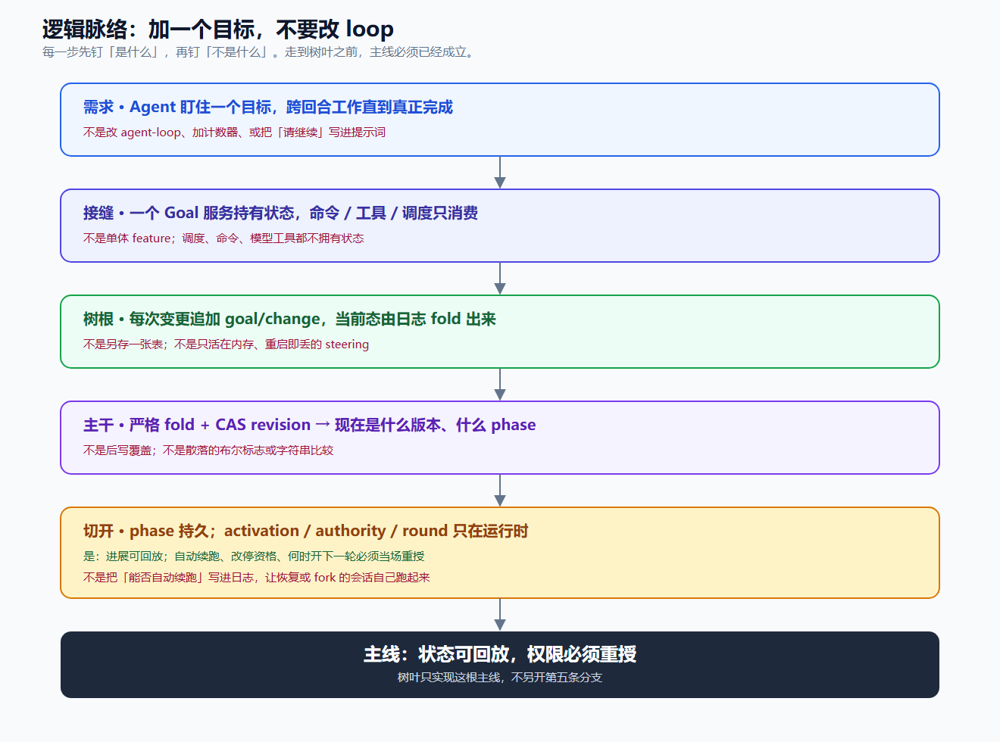

| 步 | 是什么 | 不是什么 |
|---|---|---|
| 需求 | 盯住一个目标，跨回合直到真正完成 | 改 loop、加计数器、把「请继续」写进提示词 |
| 接缝 | 一个服务持有状态；命令 / 工具 / 调度只消费 | 单体功能；消费者各存一份 |
| 树根 | 每次变更追加事件，当前态由日志折出来 | 另存一张表；只活在内存的叮嘱 |
| 主干 | 折一遍流水账，并核对版本：现在是第几版、走到哪 | 谁后写谁赢；满地布尔开关 |
| 切开 | 「走到哪」可以持久；「这一进程还准不准自动续」只活在当前进程 | 把「能否自动续跑」写进日志，让恢复或拷出来的会话自己跑起来 |

这张表是全文唯一一份对照清单。下面用人话把每一层走一遍。

---

## 从日志长出来的一棵树

目标功能不是一个开关。它是从日志长出来的。每一层只回答一个问题。红字是「不是什么」。树叶只实现所属那根枝，不另开主干。

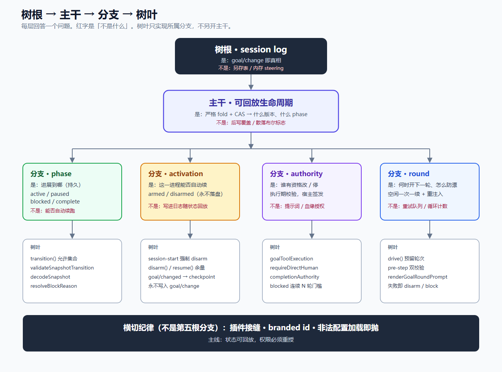

层次就是：**树根 → 主干 → 分支 → 树叶**。

---

## 状态只放在一处

人改目标、模型改目标，都进同一个服务。服务往日志里追加一条变更。空闲调度看到变更，才决定要不要开下一轮。

状态只在一处。命令、工具、调度如果各存一份，对不上就只能猜。

---

## 模型看见的，必须能翻出来

你不能一边让模型按某句话做事，一边让这句话只活在某次运行的内存里。否则「它当时到底被叮嘱了什么」，无法回放，也无法在恢复后对齐。

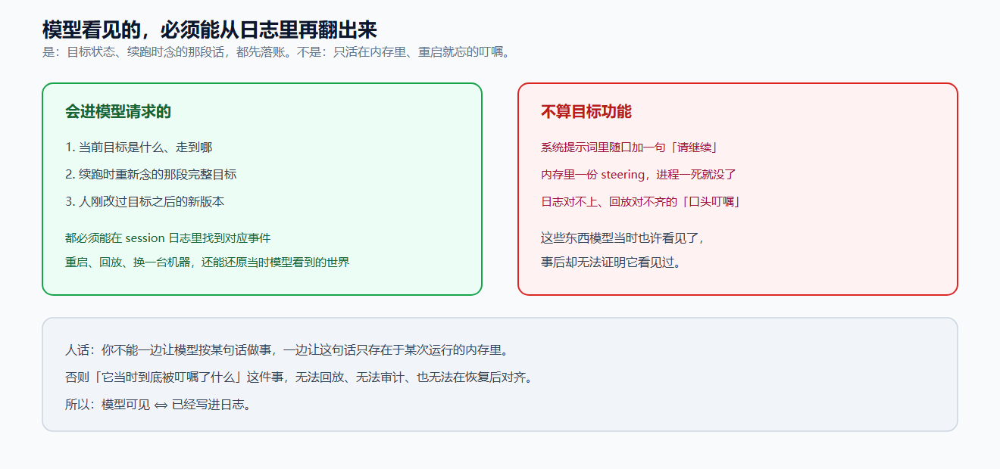

目标现在是什么、续跑时重新念的那段完整题目，都先落账。系统提示词里随口加一句「请继续」，进程一死就没了，那不算目标功能。

人话：把流水账折一遍，得到「现在」——这就是 fold。不是另开一张表当答案。

---

## 两种记账法，选一本当真相

Codex 那条路：每个线程一行表，读这一行就知道现在的目标。重启后如果还是进行中，就重新允许自动续。

DeepSeek Harness 这条路：不另开抽屉。每次变更往会话日志追加一条，把流水账折一遍，得到现在。重启强制解除「准你自动续」——账可以回放，自动续跑必须人再点一次。

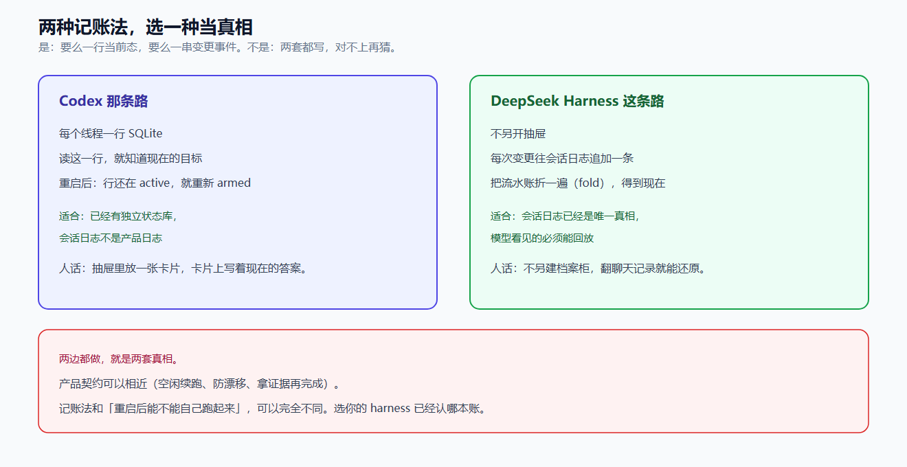

产品上可以很像：空闲了就续、防漂移、拿证据再完成。记账法，以及「重启后能不能自己跑起来」，可以完全不同。选你的系统已经认哪本账。两边都写，就是两套真相。

---

## 同时改一份账，过期的丢掉

两个人同时改同一份文档。后保存的那份，不该默默盖掉先保存的那份。

改之前记下：我看到的是第 3 版。提交时如果已经是第 4 版，这份改动作废，重新读再改。

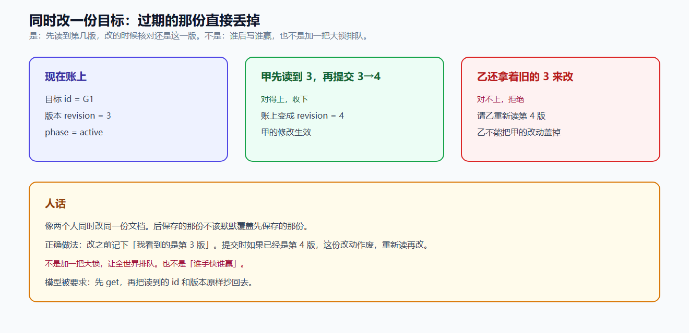

这不是加一把大锁让全世界排队，也不是谁手快谁赢。调用方必须先读到版本，再把同一个编号交回去。对不上，就拒绝。

---

## 作业可以夹书签，电脑开机不能自己写

「走到哪」写成进行中、暂停、卡住、完成，写进日志，可以回放。

「这一进程还准不准自动续」只存在于当前进程。启动、恢复、从一份会话拷出来的新会话，一律先不准续。

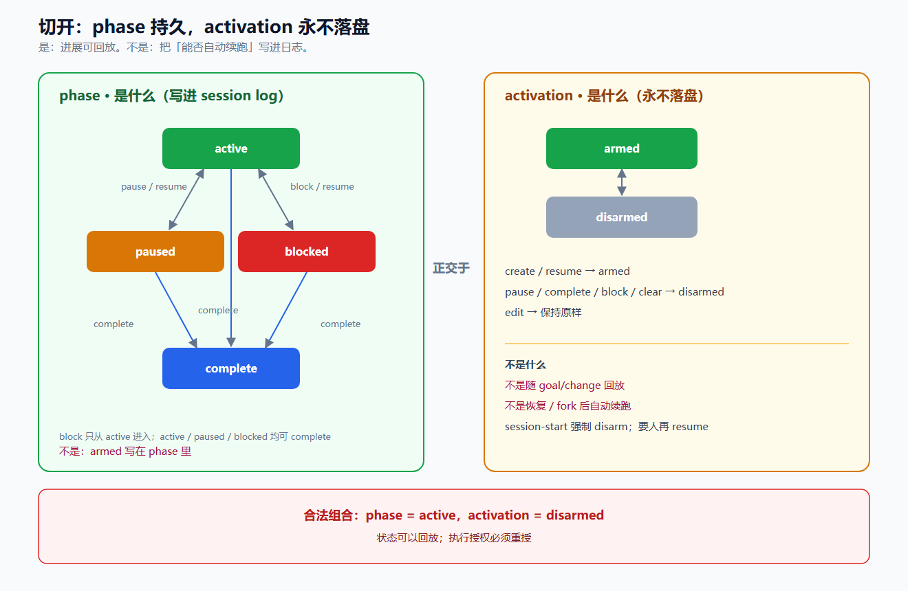

所以会有这种合法组合：账上还是进行中，这一进程却不准自动续。它不会自己跑起来。必须等人明确说继续。

你可以记住作业做到哪一页。但不能因为夹着书签，电脑一开机就自己写下去。

---

## 谁能改，看这一回合还活着

改目标、停目标，不靠「请你不要乱改」，也不靠「你是从哪个会话拷出来的」。

看这一回合还活着的事实：调用者还在，轮次还开着，改目标这件事上有没有产品界面上真人点出来的那条消息——模型伪造不了。报完成、报卡住，可以走当前这一轮的窄通道：只能报终止，不能改题目。

子代理、插件塞进来的话、已经结束的回合，过不去。

血缘能说明来历。不能代替这一回合的签发。

---

## 空了才续一次；题目每一轮重新念一遍

四个条件同时成立，才开下一轮：闲着、还在进行中、这一进程已获准自动续、轮次还没用完。每次空闲最多续一次。不是重试队列，不是定时器，不是循环计数器。

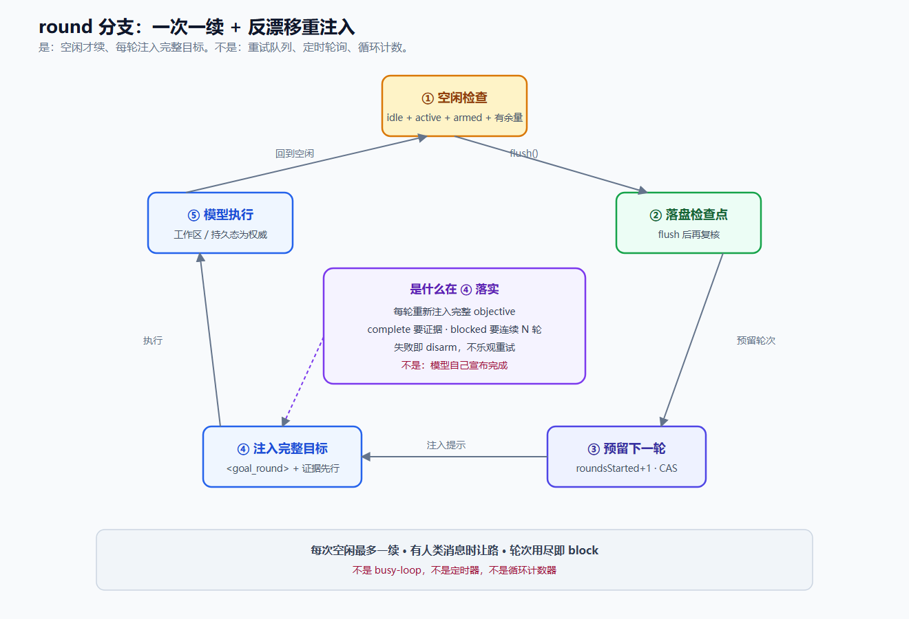

长期目标最常见的死法，不是跑不动，是模型偷偷改题。所以每一轮把完整目标再注入一次。收工不听口头，听工作区。卡住也要同一条件连续出现，才允许认输——一轮运气不好，不算。

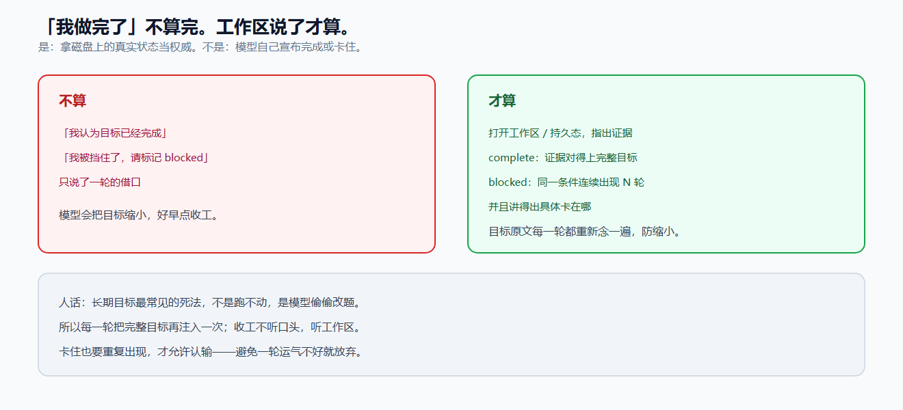

写账失败、排队失败、调度异常，都停。解除自动续，或者标成卡住。不乐观重试。

---

## 收获和结论

树叶会改名。能抄走的是下面七句。

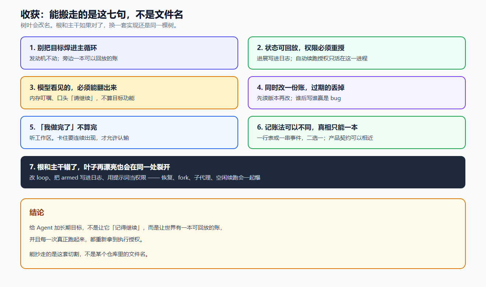

**收获**

1. **Goal 是探针，不是待办。** 验证的是：长期目标能不能当插件接上，而不拆发动机。
2. **别把目标焊进主循环。** 接不上，说明「不改 loop」只是口号。
3. **状态可回放，权限必须重授。** 不是恢复后自己接着跑。
4. **模型看见的，必须能翻出来。** 内存叮嘱不算目标功能。
5. **同时改一份账，过期的丢掉。** 谁后写谁赢是 bug。
6. **「我做完了」不算完。** 听工作区。卡住要连续出现，才允许认输。
7. **树根和主干错了，叶子再漂亮也会在同一处裂开。** 改 loop、把「准续」写进日志、用提示词当权限，会一起爆。

**结论**

给 Agent 加长期目标，不是让它「记得继续」，也不是再做一个待办列表。是用这根探针压一遍 Agent Harness：新能力能不能接插件、不拆发动机。过了这关，它才是运行时；过不去，它只是套了工具的聊天循环。

**PS.** 只带走一句的话：状态可回放，权限必须重授。

**PPS.** 这和「把模型训得更听话」不是一回事，也和待办列表不是一回事。提示词管该不该；校验管能不能；Harness 管接不接得上。

**PPPS.** 文里的名字都会过时。你自己的系统里如果只改 loop、把「准不准续」写进日志、用提示词当权限——裂开的会是同一刀。那一刀切的，正是 Harness 还算不算运行时。
